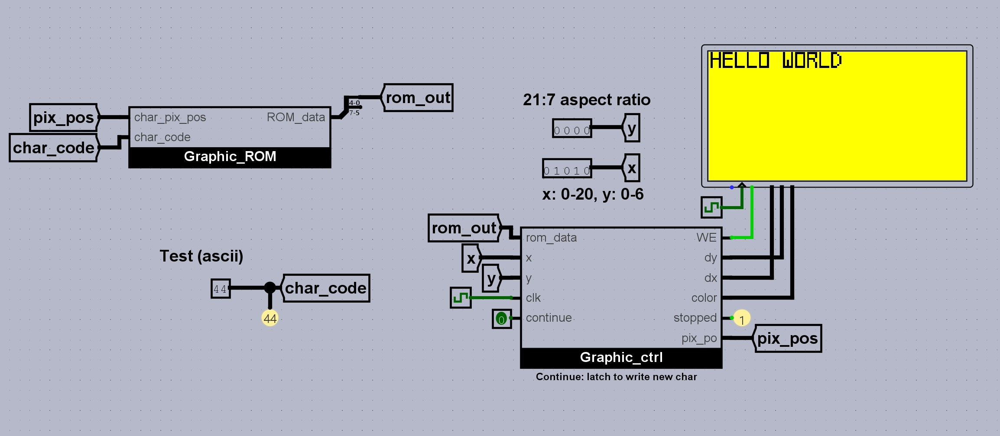

# rgb_video_card
Logisim RGB video component with a character generator ROM. 

This graphics card is an Arduino like LCD.
The display is 128x64 pixel dots. 

Each character makes up 5 by 8 dots, Hence the aspect ratio is ```21:7``` (with padding on each side).



### Customizable character set. Mine is surely awful. Generate your own char set [here](https://maxpromer.github.io/LCD-Character-Creator/). Make sure to use ```hex``` values.


# CGROM
The Character Generator ROM is pre-written with Upper case alphabet ```A-Z```and numerical ```0-9```.

To display a char, simply address the ROM with the char ASCII code. 

Eg:
```
0x41 is for the letter A, 0x30 is for 0 and so on.
```

# Built-in cursor management: 
The aspect ration is 21 by 7. So on the x axis ```column```, you can display 21 char (0 to 20) and on the y axix ```row```, 7 char (0 to 6).

Simply set the desired cursor position ```(x, y)``` and address the cgram to display the desired char.

At the end of a char fully displayed, a stop flag is raised and need to be cleared ```reset pin of a register```. Simply write ```1``` and ```0``` (push button like) to start
displaying new char again.

# Missing features
- [ ] Clear portion of the display
- [ ] Lower case ASCII char
- [ ] Support for extended ASCII char
- [ ] Punctuation char
- [ ] Use RGB colors (monochrome 4-bit in use as of now)
